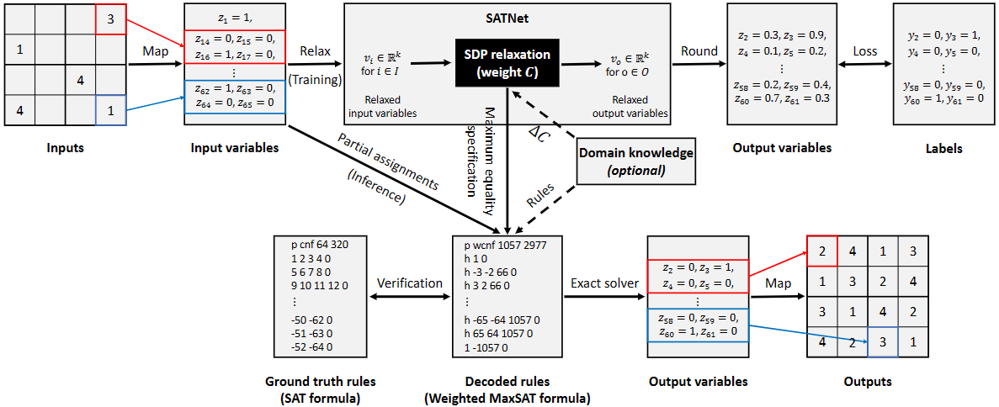

# Learning Interpretable Rules
This repository contains the source code to reproduce the experiments in the paper Learning Reliable Interpretations with SATNet.



## Setup
```
conda env create -f environment.yml
conda activate satnet-rules
python setup_satnet.py install
python setup_mixnet.py install
```
The additional dependency for the verification part is [Gurobi](https://www.gurobi.com/) 

## Data
We provide stream-transformation and sudoku benchmarks. Both the parity function and sudoku9 data are taken from [locuslab/SATNet](https://github.com/locuslab/SATNet/), sudoku4 data is provided in folder data/sudoku4data

Run the following command to generate data for addition and counting tasks:
```
python data/bits_add/gen_data.py
python data/k_modulo/gen_data.py
```

## Experiments
### Run SATNet
We run SATNet on the given benchmarks to learn the logical rules.
#### Addition
```
python exps/bits_add.py --aux 2 --model mixnet
```
#### Counting
```
python exps/k_modulo --k 2 --aux 1 --model mixnet
python exps/k_modulo --k 4 --aux 2 --model mixnet
python exps/k_modulo --k 8 --aux 4 --model mixnet
python exps/k_modulo --k 16 --aux 8 --model mixnet
```

#### Parity Function
```
python exps/parity.py --seq 20 --aux 4 --model mixnet
```

#### Sudoku
```
python exps/sudoku4.py --aux 0 --m 50 
python exps/sudoku.py --aux 300 --m 600
```

### Interpretability
Please check the [verifications](https://github.com/ML-PL/satnet-rules/tree/main/verifications) for more details.

